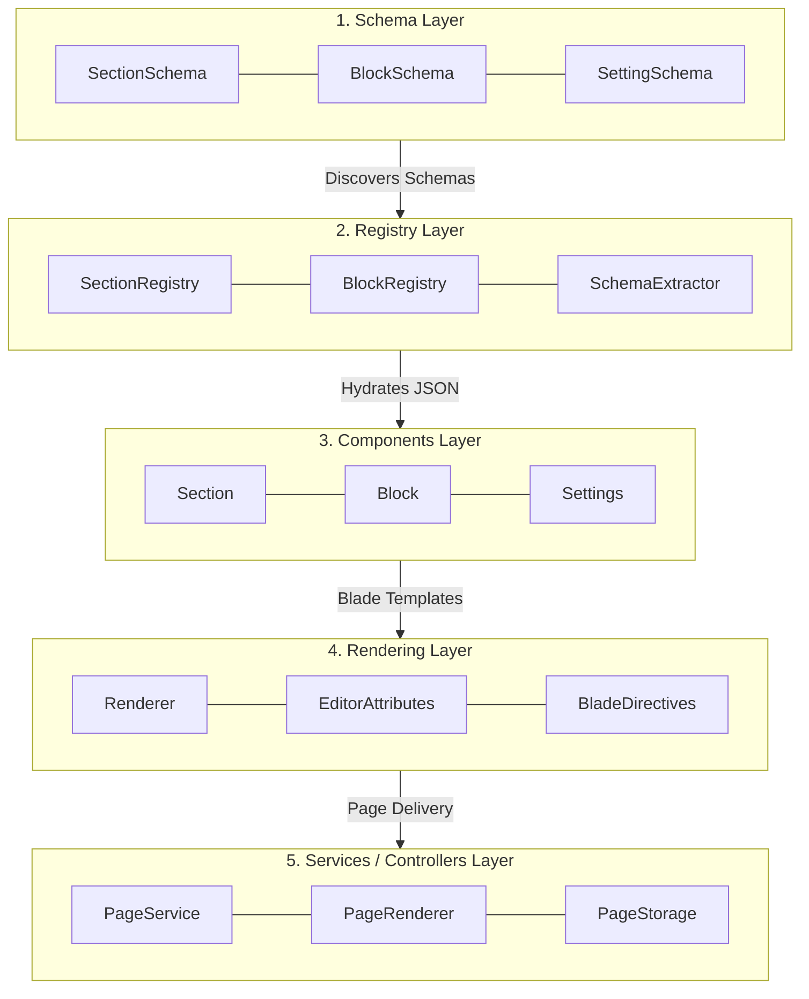
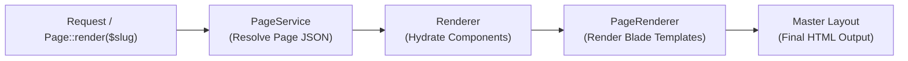
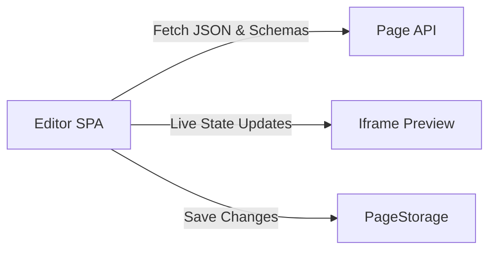

# Architecture

Laravel Page Builder follows a five-layer architecture. Dependencies flow **downward only**. Never import from a higher layer.



## The Five Layers

### 1. Schema

Immutable value objects that define the structure of sections, blocks, and settings.

- `SectionSchema` — Defines a section type with its settings and allowed blocks
- `BlockSchema` — Defines a block type with its settings
- `SettingSchema` — Defines a single setting with type, label, and default value

```php
use PageBuilder\Schema\SectionSchema;

$schema = new SectionSchema([
    'name' => 'Hero',
    'settings' => [
        [
            'id' => 'title',
            'type' => 'text',
            'label' => 'Title',
            'default' => 'Welcome'
        ],
    ],
]);
```

### 2. Registry

Discovers and stores schemas from Blade `@schema()` directives.

- `SectionRegistry` — Discovers section Blade files and extracts schemas
- `BlockRegistry` — Discovers block Blade files and extracts schemas
- `SchemaExtractor` — Parses `@schema` directives from Blade files

```php
use PageBuilder\Facades\Section;
use PageBuilder\Facades\Block;

// Register additional paths
Section::add(resource_path('views/custom-sections'));
Block::add(resource_path('views/custom-blocks'));
```

### 3. Components

Runtime Section/Block instances hydrated from page JSON.

- `Section` — Runtime section object with settings, blocks, and editor attributes
- `Block` — Runtime block object with settings, blocks, and editor attributes
- `Settings` — Settings value object with magic property access

```blade
{{-- In a section Blade file --}}
<section {!! $section->editorAttributes() !!}>
    <h1>{{ $section->settings->title }}</h1>
    @blocks($section)
</section>
```

### 4. Rendering

Blade rendering engine that transforms JSON into HTML.

- `Renderer` — Core rendering engine: hydrates JSON into objects, renders via Blade
- `EditorAttributes` — Generates `data-editor-*` attributes for sections/blocks
- `BladeDirectives` — Registers `@blocks`, `@sections`, `@schema`, `@pbEditorClass`

```php
use PageBuilder\Facades\Page;

// Render a page
$html = Page::render('home');

// Render with extra meta
$html = Page::render('home', ['title' => 'My Home Page']);
```

### 5. Services

High-level services for page management and theme configuration.

- `PageRenderer` — Loads page JSON, renders all enabled sections in order
- `PageStorage` — Reads/writes page JSON files to disk
- `PageRegistry` — Cached page manifest for fast lookups
- `ThemeSettings` — Global theme settings persistence and access

```php
use PageBuilder\Facades\Page;
use PageBuilder\Facades\Theme;

// Get page data
$page = Page::find('home');

// Get theme settings
$settings = Theme::settings();
```

## Data Flow

### Page Rendering Flow

1. **Resolution** — `Page::render($slug)` resolves page data via `PageService`, fetching stored JSON from `PageStorage` or template definitions from `TemplateStorage`.
2. **Hydration** — `Renderer` hydrates the page JSON into runtime `Section` and `Block` instances, populating default setting values from registered schemas.
3. **Execution** — `PageRenderer` iterates through active sections in order, executing section Blade templates and expanding nested `@blocks` directives.
4. **Output** — Section HTML is compiled into the active master layout for delivery.



### Editor Flow

1. **Shell Load** — Editor interface (React SPA) initializes and loads page metadata.
2. **Data Fetch** — Frontend fetches registered schemas and current page JSON via API.
3. **Live Preview** — Visual edits update component state and render live within an iframe preview shell.
4. **Persistence** — Saving updates passes JSON to `PageStorage` for file/database persistence.



## Key Classes

| Class             | Layer      | Responsibility                       |
| ----------------- | ---------- | ------------------------------------ |
| `SectionSchema`   | Schema     | Immutable section type definition    |
| `BlockSchema`     | Schema     | Immutable block type definition      |
| `SettingSchema`   | Schema     | Immutable setting definition         |
| `SectionRegistry` | Registry   | Discovers and stores section schemas |
| `BlockRegistry`   | Registry   | Discovers and stores block schemas   |
| `Section`         | Components | Runtime section instance             |
| `Block`           | Components | Runtime block instance               |
| `Settings`        | Components | Settings value object                |
| `Renderer`        | Rendering  | Core rendering engine                |
| `PageRenderer`    | Services   | Full page rendering                  |
| `PageStorage`     | Services   | JSON file read/write                 |
| `ThemeSettings`   | Services   | Theme settings persistence           |

## Facades

```php
use PageBuilder\Facades\Section;
use PageBuilder\Facades\Block;
use PageBuilder\Facades\Page;
use PageBuilder\Facades\Theme;
```

Facades provide a static interface to the underlying services.
